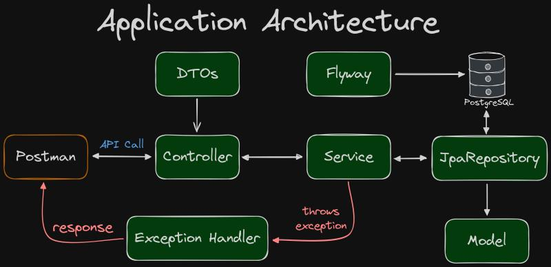

<h1 align="center" style="font-weight: bold;">
Plan.ner
</h1>

<div align="center">


</div>

<p align="center">
    <a href="#started">Getting Started</a> •
    <a href="#routes">API Endpoints</a> •
    <a href="#architecture">Application Architecture</a> •
    <a href="#database">Database</a> •
    <a href="#kubernetes">Kubernetes</a>
</p>

<h2 id="started">About</h2>
This project is an API built using Java, Java Spring.

The API emulates a travel planning application. The API has been deployed on AWS utilizing Amazon EKS.

<h2 id="started">Getting started</h2>

<h3>Prerequisites</h3>

- Cloning de repository

```bash
git clone https://github.com/vitorstaub/plan.ner-nlw.git

cd plan.ner-nlw
```
- Install dependencies with Maven
- Install [Docker](https://www.docker.com/)

<h3>Starting</h3>
- Start the application with Docker

```bash
docker-compose up -d
```

Accessible at
```
http://localhost:8081
```

<h2 id="routes">API Endpoints</h2>

The API provides the following endpoints:

```markdown
POST /trips - Register a new trip.

GET /trips/{tripId} - Retrieve a specific trip by ID.

PUT /trips/{tripId} - Update a trip.

GET /trips/{tripId}/confirm - Confirm a trip.

POST /trips/{tripId}/activities - Register a new activity to a trip.

GET /trips/{tripId}/activities - Retrieve all activities.

POST /trips/{tripId}/invite - Invite a participant to a trip.

GET /trips/{tripId}/invite - Retrieve all participants.

POST /trips/{tripId}/links - Register a new link to a trip.

GET /trips/{tripId}/links - Retrieve all links.
```

<h2 id="architecture">Application Architecture</h2>

<p align="center">
    
</p>

<h2 id="database">Database</h2>

The project uses [Postgres](https://www.postgresql.org/). The necessary database migrations are managed using Flyway.

<h2 id="kubernetes">Start with Kubernetes</h2>

<h3>Prerequisites</h3>

- Install [K3D](https://k3d.io/)
- Install [Kubectl](https://kubernetes.io/pt-br/docs/tasks/tools/)

<h3>Starting</h3>

```bash
k3d cluster create planner-nlw --servers 2 --api-port localhost:6443 // create a cluster in docker

kubectl cluster-info // show cluster information

kubectl create namespace planner  // create a namespace

kubectl apply -f k8s -n planner // run kubernetes files
```

To manage Kubernetes clusters with dashboards install -> [Lens](https://docs.k8slens.dev/getting-started/install-lens/)

<h2>Contributing</h2>

When contributing to this project, please the existing code style, [commit conventions](https://www.conventionalcommits.org/en/v1.0.0/), and submit your changes in a separate branch.